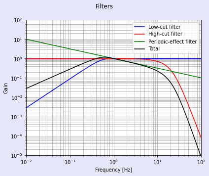

# shindo.py
Calculates JMA (Japan Meteorological Agency) seismic intensity (shindo) scale from acceleration data stored in NumPy array

## Introduction
Japan is a country known for frequent earthquake occurrence. A special scale to evaluate the seismic intensity called *shindo* (震度) have been defined by the Japan Meteorological Agency (JMA).
Long ago, the shindo scale was determined by personnel who inspect the damaged area in person to observe the ratio of collapsed houses, etc.
However, from a few decades ago, it was begun to calculate the shindo scale from digital accelerometers. The shindo scale has values from 0 to 7, where actually 5 and 6 are devided into 5-, 5+, 6-, and 6+.

This Python module, `shindo.py`, calculates the shindo scale from 3-D acceleration data stored in a NumPy array in the unit of [gal] or [cm/s2].

## Calculation method
Usually, the acceleration data for north-south, east-west, and up-down axes are acquired every 10 ms to calculate shindo. If a NumPy array stores the acceleration data as such in [gal], this Python module can calculates shindo.

### Calculation steps
There are seven steps to calculate shindo from acceleration data.

1. Each of the 3-D acceleration data is transformed into frequency domain by DFT or FFT.
2. Three special filters are appplied to the 3-D acceleration spectra.
3. The spectra is transformed back into time domain by inverse DFT or FFT.
4. The root-sum-square (RSS) acceleration (i.e. the absolute value of the vector sum) is calculated from the time-domain north-south, east-west, and up-down data obtained in 3.
5. A value called a is found where the RSS acceleration is above the value of a for 0.3 seconds.
6. A value called I is obtained by I = 2 log10 a + 0.94.
7. I is rounded at the third digits from the decimal point and cut off the fractional values below the second digit from the decimal point.

### Special filters
Three filters are applied to the spectra, namely, the periodic-effect filter, the high-cut filter, and the low-cat filter. The mathematical expression of these filters can be found in the [WikiPedia article](https://ja.wikipedia.org/wiki/%E6%B0%97%E8%B1%A1%E5%BA%81%E9%9C%87%E5%BA%A6%E9%9A%8E%E7%B4%9A), but the gain of the filters are shown below.

In frequency domain, &ldquo;applying filters&rdquo; means just multiplying the gain in the figure above to the spectra, i.e., product of two NumPy arrays if the filters are also expressed as a NumPy array.

## How to use
#### `shindo.getShindo(a: numpy.ndarray, Ts: float) -> float`
Giving an NumPy array `a` whose shape is (N, 3) to this `shindo.getShindo()` function returns the JMA *instrumental* shindo value, which corresponds to the result, I, after Step 7 above. `Ts` is the sampling period. Usually, Ts = 0.01 if you give this function the recorded past seismic data from the JMA website.

The number of data points of the NumPy array, N, is arbitrary. However, the number of data points should contain enough length in time domain, e.g., 5 seconds, to enable accurate calculation of shindo. If Ts = 10 ms, N = 500 for 5 seconds of acceleration data.

#### `shindo.getShindoName(I: float, lang: str = 'jp') -> str`
This functon converts the JMA instrumental shindo scale, which may have fractional values below the decimal point, into the actual shindo scale. If `lang = 'jp'` is given, shindo 5-, 5+, 6-, and 6+ becomes 5弱, 5強, 6弱, and 6強 by this function.
if `lang != 'jp'`, 5-, 5+, 6-, and 6+ are returned, as a string. Shindo 0-4 are also returned as a string.

## Test bench
This module contains the `if __name__ == '__main__':` section in order to allow to be run and test itself. A data of past major earthquake, which was observed in Yonago, Tottori, Japan, is automatically downloaded as a CSV file and the acceleration data is acquired as a NumPy array. The calculation will show shindo 5.1, which is equal to the value available on the JMA website. You can change the past earthquake if you know the URL of the CSV file. See [this website](https://www.data.jma.go.jp/svd/eqev/data/kyoshin/jishin/index.html) for the past major earthquake acceleration data.
